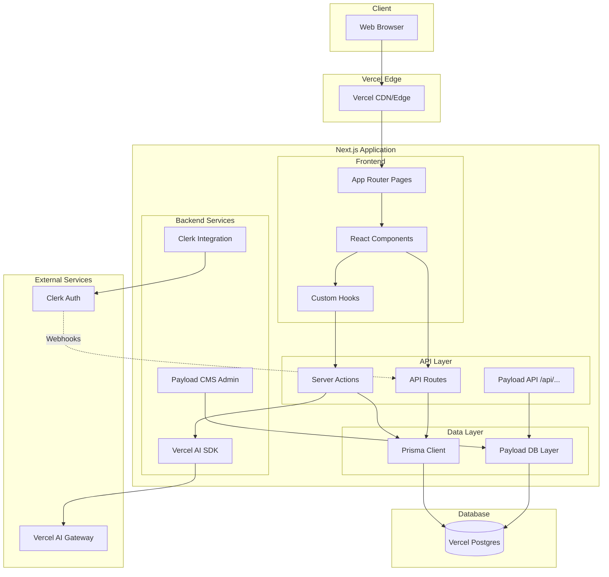
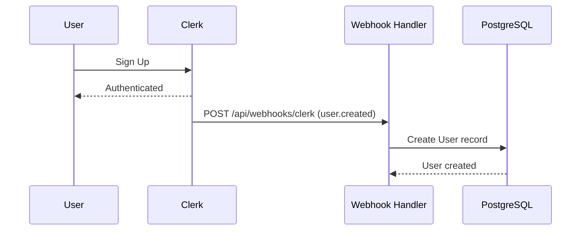
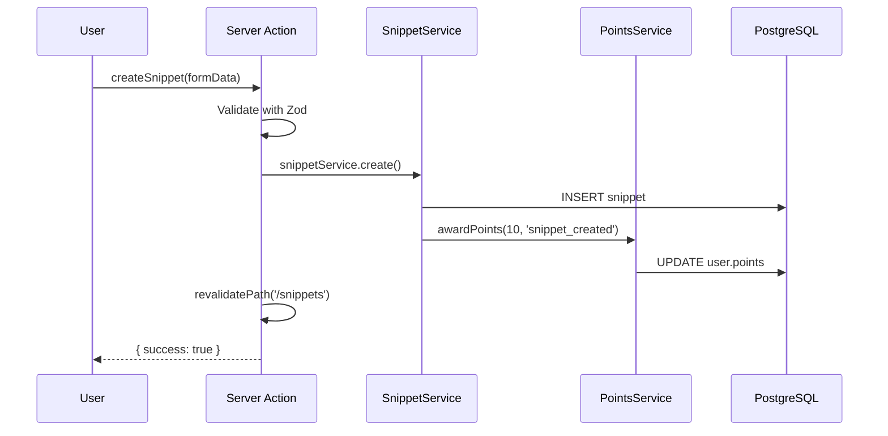
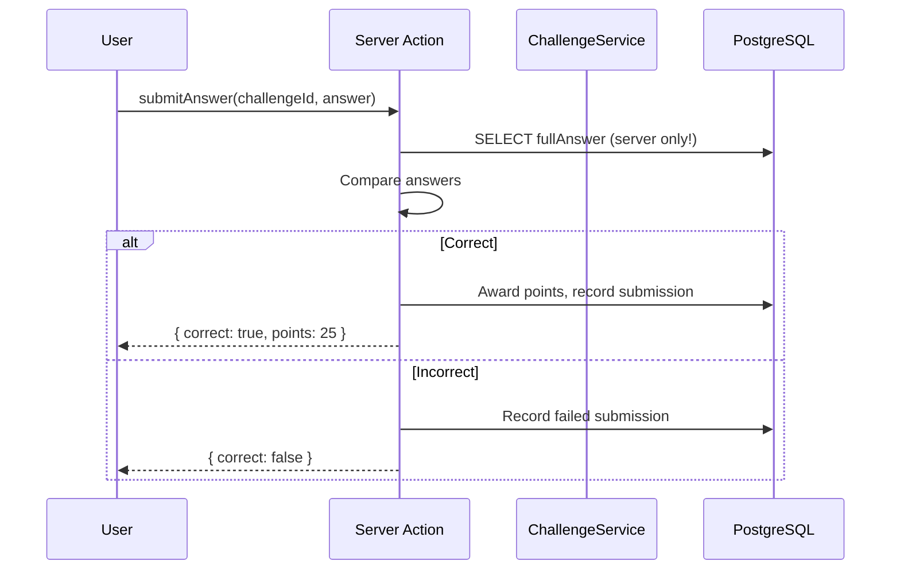

# DevHub Fullstack Architecture Document

## Introduction

This document outlines the complete fullstack architecture for DevHub, including backend systems, frontend implementation, and their integration. It serves as the single source of truth for AI-driven development, ensuring consistency across the entire technology stack.

This unified approach combines what would traditionally be separate backend and frontend architecture documents, streamlining the development process for modern fullstack applications where these concerns are increasingly intertwined.

### Starter Template

**Beslutning:** Bruk `create-payload-app` som base, deretter manuell integrasjon av:
- Prisma (for app-data)
- Clerk (for autentisering)
- shadcn/ui (for UI-komponenter)

Dette gir en god balanse mellom effektivitet og læring.

### Change Log

| Date | Version | Description | Author |
|------|---------|-------------|--------|
| 2025-01-21 | 0.1 | Initial architecture based on PRD | Architect Winston |

---

## High Level Architecture

### Technical Summary

DevHub er en **monolittisk fullstack-applikasjon** bygget på Next.js 14+ med App Router, der Payload CMS 3.x er integrert for innholdsadministrasjon og pagebuilder-funksjonalitet. Applikasjonen bruker en **dual-ORM strategi**: Payload håndterer CMS-innhold (pages, media) via sitt interne database-lag, mens Prisma ORM håndterer all app-spesifikk data (brukere, snippets, diskusjoner, challenges) mot samme PostgreSQL-database. Autentisering håndteres av Clerk med webhook-basert synkronisering til Prisma User-modellen. AI-funksjonalitet leveres via Vercel AI SDK med strukturert output for challenge-generering og hints. Hele stacken deployes som én enhet til Vercel med Vercel Postgres (Neon) som database.

### Platform and Infrastructure

```
Platform:        Vercel
Key Services:    Vercel Hosting, Vercel Postgres (Neon), Vercel AI Gateway
Regions:         Frankfurt (eu-central-1)
```

### Repository Structure

```
Struktur:           Single Next.js repo med Payload integrert
Monorepo Tool:      Ingen (ikke nødvendig for dette prosjektet)
Package Strategy:   Alt i én app - enklere å forstå
```

### High Level Architecture Diagram



### Architectural Patterns

| Pattern | Beskrivelse | Rationale |
|---------|-------------|-----------|
| **Server Components First** | React Server Components som default, Client Components kun ved behov | Optimal ytelse, redusert JS bundle, bedre SEO |
| **Server Actions for Mutations** | Bruk Next.js Server Actions for data-endringer | Type-safe, eliminerer manuell API-kode, progressiv enhancement |
| **Repository Pattern (Prisma)** | Abstraher database-tilgang i dedikerte funksjoner | Testbarhet, gjenbruk, enkelt å bytte database senere |
| **Composition over Inheritance** | Små, gjenbrukbare React-komponenter | shadcn/ui filosofi, fleksibilitet |
| **Feature-based Organization** | Gruppér kode etter feature, ikke teknisk lag | Lettere å navigere, bedre kobling |
| **Webhook-driven Sync** | Clerk → Database via webhooks | Robust, håndterer alle edge cases |
| **Structured AI Output** | Zod-validering av all AI-generert data | Forutsigbarhet, type-sikkerhet |
| **Skeleton Loading** | Content-aware skeletons for alle loading states | Bedre UX, ingen generiske spinners |

---

## Tech Stack

| Kategori | Teknologi | Versjon | Formål | Rationale |
|----------|-----------|---------|--------|-----------|
| **Frontend Language** | TypeScript | 5.x | Type-safe utvikling | PRD krav: strict mode, læringsmål |
| **Frontend Framework** | Next.js | 14.x+ | Fullstack React framework | App Router, Server Components |
| **UI Component Library** | shadcn/ui | latest | Kopierbare UI-komponenter | Tailwind-basert, fleksibel |
| **State Management** | React hooks + Context | built-in | Lokal og delt state | Server Components reduserer behov |
| **Backend Language** | TypeScript | 5.x | Samme språk hele stacken | Konsistens, delte typer |
| **Backend Framework** | Next.js API Routes + Server Actions | 14.x+ | API og mutasjoner | Integrert, type-safe |
| **CMS** | Payload CMS | 3.x | Admin panel, pagebuilder | Self-hosted, PostgreSQL adapter |
| **API Style** | Server Actions + REST (Payload) | - | Data-operasjoner | Server Actions for app, Payload for CMS |
| **Database** | PostgreSQL | 15+ | Relasjonell datalagring | Vercel Postgres (Neon) |
| **ORM (App Data)** | Prisma | 5.x | Type-safe database queries | Relevant for jobb, god læring |
| **ORM (CMS Data)** | Drizzle (via Payload) | internal | Payload's database-lag | Håndteres automatisk |
| **Authentication** | Clerk | latest | Brukerautentisering | Roller og sessions |
| **AI Integration** | Vercel AI SDK | 3.x | AI-features | Strukturert output, følg offisiell docs |
| **File Storage** | Payload Media | built-in | Bildeopplastinger | Innebygd håndtering |
| **CSS Framework** | Tailwind CSS | 3.x | Utility-first styling | Via shadcn/ui |
| **Code Highlighting** | Shiki | 1.x | Syntax highlighting | VS Code themes, server-side |
| **Validation** | Zod | 3.x | Schema-validering | Type-safe, AI output |
| **Frontend Testing** | Vitest | 1.x | Unit/integration tests | Raskere enn Jest |
| **Backend Testing** | Vitest | 1.x | API/service tests | Konsistens |
| **E2E Testing** | Playwright | latest | (Valgfritt) End-to-end | Moderne |
| **Package Manager** | pnpm | 8.x | Dependency management | Rask og streng |
| **Build Tool** | Next.js (Turbopack) | built-in | Bundling og bygging | Rask dev server |
| **Linting** | ESLint | 8.x | Kodekvalitet | Standard |
| **Formatting** | Prettier | 3.x | Kodeformatering | Konsistent stil |
| **CI/CD** | Vercel + GitHub Actions | - | Automatisk deploy | Vercel for deploy, GH for tests |
| **Monitoring** | Vercel Analytics | built-in | Performance monitoring | Gratis med Vercel |

---

## Data Models

### Oversikt: Prisma vs Payload

```
┌─────────────────────────────────────────────────────────────────┐
│                    PostgreSQL Database                          │
├────────────────────────────┬────────────────────────────────────┤
│     PAYLOAD TABLES         │         PRISMA TABLES              │
│     (CMS-innhold)          │         (App-data)                 │
├────────────────────────────┼────────────────────────────────────┤
│  • pages                   │  • User                            │
│  • media                   │  • Snippet                         │
│  • payload_users           │  • Tag                             │
│  • payload_migrations      │  • Discussion                      │
│  • _pages_blocks_*         │  • Comment                         │
│                            │  • Challenge                       │
│                            │  • Submission                      │
│                            │  • Like                            │
│                            │  • Bookmark                        │
│                            │  • Badge                           │
│                            │  • UserBadge                       │
│                            │  • PointTransaction                │
│                            │  • HintRequest                     │
└────────────────────────────┴────────────────────────────────────┘
```

### User

**Formål:** Representerer en bruker synkronisert fra Clerk

```typescript
interface User {
  id: string;              // Clerk user ID (primary key)
  email: string;
  username: string;        // Unik, URL-vennlig
  displayName: string;
  avatarUrl: string | null;
  bio: string | null;
  role: 'GUEST' | 'MEMBER' | 'MODERATOR' | 'ADMIN';
  points: number;          // Aggregert poengsum
  createdAt: Date;
  updatedAt: Date;
}
```

### Snippet

**Formål:** Kode-snippet delt av brukere

```typescript
interface Snippet {
  id: string;
  title: string;
  description: string | null;
  code: string;
  language: string;
  authorId: string;
  likeCount: number;
  createdAt: Date;
  updatedAt: Date;
}
```

### Tag

**Formål:** Kategorisering av snippets og diskusjoner

```typescript
interface Tag {
  id: string;
  name: string;
  slug: string;
  color: string | null;
  createdAt: Date;
}
```

### Discussion

**Formål:** Diskusjonstråd startet av bruker

```typescript
interface Discussion {
  id: string;
  title: string;
  content: string;         // Markdown
  authorId: string;
  commentCount: number;
  aiSummary: string | null;
  createdAt: Date;
  updatedAt: Date;
}
```

### Comment

**Formål:** Kommentar på diskusjon, støtter nesting

```typescript
interface Comment {
  id: string;
  content: string;
  authorId: string;
  discussionId: string;
  parentId: string | null;
  depth: number;           // 0 = top-level, max 4
  likeCount: number;
  createdAt: Date;
  updatedAt: Date;
}
```

### Challenge

**Formål:** AI-generert algoritme-utfordring

```typescript
interface Challenge {
  id: string;
  title: string;
  lore: string;            // Markdown
  difficulty: 'EASY' | 'MEDIUM' | 'HARD';
  points: number;
  dataFormat: 'TEXT' | 'JSON' | 'CSV' | 'NUMBERS';
  exampleData: string;
  exampleAnswer: string;
  fullData: string;
  fullAnswer: string;      // ALDRI eksponert til frontend!
  isPublished: boolean;
  createdAt: Date;
  updatedAt: Date;
}
```

### Submission

**Formål:** Brukers svar på challenge

```typescript
interface Submission {
  id: string;
  userId: string;
  challengeId: string;
  answer: string;
  isCorrect: boolean;
  pointsAwarded: number;
  createdAt: Date;
}
```

### Like, Bookmark, Badge, UserBadge, PointTransaction, HintRequest

Se Prisma schema for komplett definisjon.

---

## API Specification

### API-strategi

```
┌──────────────────────────────────────────────────────────────────┐
│                        API ARCHITECTURE                          │
├──────────────────────────────────────────────────────────────────┤
│  ┌─────────────────────┐    ┌─────────────────────┐             │
│  │   SERVER ACTIONS    │    │    API ROUTES       │             │
│  │   (App Data)        │    │    (Spesielle behov)│             │
│  ├─────────────────────┤    ├─────────────────────┤             │
│  │ • createSnippet()   │    │ /api/webhooks/clerk │             │
│  │ • updateSnippet()   │    │ /api/ai/generate    │             │
│  │ • toggleLike()      │    │ /api/ai/hint        │             │
│  │ • submitAnswer()    │    │ /api/health         │             │
│  └─────────────────────┘    └─────────────────────┘             │
│                                                                  │
│                             ┌─────────────────────┐             │
│                             │   PAYLOAD API       │             │
│                             │   (CMS Content)     │             │
│                             ├─────────────────────┤             │
│                             │ /api/pages          │             │
│                             │ /api/media          │             │
│                             └─────────────────────┘             │
└──────────────────────────────────────────────────────────────────┘
```

### Server Actions

```typescript
// Snippets
createSnippet(formData): Promise<ActionResult<{ id: string }>>
updateSnippet(id, formData): Promise<ActionResult<Snippet>>
deleteSnippet(id): Promise<ActionResult<void>>

// Discussions & Comments
createDiscussion(formData): Promise<ActionResult<{ id: string }>>
createComment(data): Promise<ActionResult<Comment>>

// Challenges
submitAnswer(challengeId, answer): Promise<ActionResult<SubmissionResult>>
getHint(challengeId, hintNumber): Promise<ActionResult<HintResult>>

// Interactions
toggleSnippetLike(snippetId): Promise<{ liked: boolean; count: number }>
toggleBookmark(snippetId): Promise<{ bookmarked: boolean }>

// Users
updateProfile(data): Promise<ActionResult<User>>
```

### API Routes

```typescript
// Webhooks
POST /api/webhooks/clerk     // Clerk user sync

// AI
POST /api/ai/generate-challenge  // Admin only
POST /api/ai/hint               // User, rate limited
POST /api/ai/summarize          // User

// Health
GET /api/health
```

---

## External APIs

### Clerk Authentication API

- **Purpose:** Brukerautentisering, sessions, roller
- **Documentation:** https://clerk.com/docs
- **Authentication:** SDK + Webhooks med Svix verification

### Vercel AI SDK

- **Purpose:** AI-generering for challenges, hints, summaries
- **Documentation:** https://sdk.vercel.ai/docs
- **VIKTIG:** Følg offisiell dokumentasjon eksakt
- **Patterns:** `generateObject()` med Zod, `generateText()`, `streamText()`

### Vercel Postgres (Neon)

- **Purpose:** PostgreSQL database hosting
- **Documentation:** https://vercel.com/docs/storage/vercel-postgres
- **Connection:** Via Prisma med pooling

---

## Core Workflows

### User Registration & Sync



### Create Snippet



### Challenge Submission



---

## Database Schema

Se komplett Prisma schema i `prisma/schema.prisma`.

### Key Indexes

| Table | Index | Purpose |
|-------|-------|---------|
| `User` | `points DESC` | Leaderboard |
| `Snippet` | `createdAt DESC` | Newest first |
| `Snippet` | `likeCount DESC` | Most popular |
| `Comment` | `discussionId` | Load thread comments |
| `Submission` | `[userId, challengeId]` | Check if solved |

---

## Frontend Architecture

### Component Organization

```
components/
├── ui/              # shadcn/ui (auto-generated)
├── layout/          # App shell, header, sidebar
├── snippets/        # Snippet feature + skeletons
├── discussions/     # Discussion feature + skeletons
├── challenges/      # Challenge feature + skeletons
├── gamification/    # Points, badges, leaderboard
├── profile/         # User profile
├── pagebuilder/     # CMS blocks
└── shared/          # Cross-feature (tags, likes, etc.)
```

### Skeleton Pattern (MANDATORY)

```typescript
// Hver feature-komponent har matchende skeleton
// components/snippets/
//   snippet-card.tsx
//   snippet-card-skeleton.tsx  ← Samme dimensjoner

// ALDRI dette:
if (loading) return <Spinner />

// ALLTID dette:
if (loading) return <SnippetCardSkeleton />
```

### State Management

- **Server State:** React Server Components + Server Actions
- **URL State:** searchParams for filters, pagination
- **Local UI State:** useState for forms, modals
- **Optimistic Updates:** useOptimistic for likes/bookmarks

### Routing (App Router)

```
app/
├── (marketing)/          # Landing page (minimal layout)
├── (app)/                # Main app (full layout)
│   ├── home/
│   ├── snippets/
│   ├── discussions/
│   ├── challenges/
│   └── ...
├── admin/                # Payload CMS
├── sign-in/              # Clerk
└── sign-up/              # Clerk
```

---

## Backend Architecture

### Service Layer

```
lib/
├── actions/              # Server Actions (entry points)
├── services/             # Business logic
├── db/
│   ├── index.ts          # Prisma client
│   └── repositories/     # Data access
├── schemas/              # Zod validation
├── types/                # TypeScript types
└── utils/                # Helpers (auth, errors)
```

### Auth Flow

```typescript
// lib/utils/auth.ts
getCurrentUser(): Promise<User | null>
requireUser(): Promise<User>           // Throws if not logged in
requireRole(role): Promise<User>       // Role check
canEdit(user, resourceAuthorId): boolean
```

### Webhook Handler

- Verifies Svix signature
- Handles: user.created, user.updated, user.deleted
- Syncs Clerk data to Prisma User model

---

## Unified Project Structure

```
devhub/
├── app/                  # Next.js App Router
├── components/           # React Components
├── lib/                  # Backend/shared code
├── payload/              # Payload CMS config
├── prisma/               # Prisma schema & migrations
├── public/               # Static assets
├── tests/                # Test files
├── docs/                 # Documentation
├── .env.example
├── middleware.ts         # Clerk auth middleware
├── next.config.mjs
├── package.json
├── tailwind.config.ts
└── tsconfig.json
```

---

## Development Workflow

### Initial Setup

```bash
pnpm install
cp .env.example .env.local
# Fill in credentials
pnpm db:generate
pnpm db:migrate
pnpm db:seed
pnpm dev
```

### Key Commands

```bash
pnpm dev              # Start development
pnpm db:studio        # Visual database browser
pnpm db:migrate       # Create & apply migration
pnpm lint:fix         # Fix linting issues
pnpm type-check       # TypeScript check
pnpm test             # Run tests
```

### Git Workflow

```bash
# Branch naming
feat/snippet-crud
fix/login-redirect
refactor/services

# Commits (conventional)
feat: add snippet creation form
fix: resolve auth redirect loop
```

---

## Deployment Architecture

### Deployment Strategy

```
Platform:           Vercel
Build Command:      pnpm build
Output Directory:   .next
Install Command:    pnpm install
Node Version:       18.x
```

### Environments

| Environment | URL | Database | Purpose |
|-------------|-----|----------|---------|
| **Development** | localhost:3000 | Vercel Postgres (dev branch) | Lokal utvikling |
| **Preview** | *.vercel.app | Vercel Postgres (preview) | PR testing |
| **Production** | devhub.vercel.app | Vercel Postgres (production) | Live |

### CI/CD Pipeline

```yaml
# .github/workflows/ci.yml
name: CI
on:
  pull_request:
    branches: [main]
  push:
    branches: [main]

jobs:
  quality:
    runs-on: ubuntu-latest
    steps:
      - uses: actions/checkout@v4
      - uses: pnpm/action-setup@v2
      - uses: actions/setup-node@v4
      - run: pnpm install --frozen-lockfile
      - run: pnpm db:generate
      - run: pnpm type-check
      - run: pnpm lint
      - run: pnpm test
```

### Database Migrations

```json
// package.json - migrations run automatically on deploy
{
  "scripts": {
    "build": "next build",
    "postbuild": "prisma migrate deploy"
  }
}
```

---

## Security and Performance

### Security Requirements

| Area | Strategy |
|------|----------|
| **HTTPS** | Vercel enforces automatically |
| **XSS Prevention** | React escapes by default, sanitize markdown |
| **CSRF** | Server Actions have built-in protection |
| **SQL Injection** | Prisma parameterizes automatically |
| **Input Validation** | Zod on all inputs, server-side |
| **Auth** | Clerk middleware on protected routes |
| **Sensitive Data** | Never expose fullAnswer, use explicit select |
| **Rate Limiting** | Upstash Ratelimit for AI endpoints |

### Security Headers

```javascript
// next.config.mjs
const securityHeaders = [
  { key: 'X-DNS-Prefetch-Control', value: 'on' },
  { key: 'Strict-Transport-Security', value: 'max-age=63072000; includeSubDomains; preload' },
  { key: 'X-Frame-Options', value: 'SAMEORIGIN' },
  { key: 'X-Content-Type-Options', value: 'nosniff' },
  { key: 'Referrer-Policy', value: 'origin-when-cross-origin' },
];
```

### Performance Targets

| Metric | Target | Strategy |
|--------|--------|----------|
| **LCP** | < 2.5s | Server Components, Image optimization |
| **FID** | < 100ms | Minimal client JS, code splitting |
| **CLS** | < 0.1 | Skeleton loaders, reserved space |
| **API Response** | < 200ms p95 | Indexed queries, connection pooling |

### Caching Strategy

```typescript
// Next.js caching
import { unstable_cache } from 'next/cache';

const getCachedSnippets = unstable_cache(
  async (filters) => db.snippet.findMany({ where: filters }),
  ['snippets'],
  { revalidate: 60 }
);

// Invalidation
revalidatePath('/snippets');
revalidateTag('snippets');
```

---

## Testing Strategy

### Testing Pyramid

```
          /\
         /E2E\        ← Minimal (manual OK)
        /______\
       /        \
      /Integration\   ← Server Actions, API
     /______________\
    /                \
   /    Unit Tests    \ ← Services, utils
  /____________________\
```

### Test Organization

```
tests/
├── setup.ts                 # Global setup
├── utils/test-helpers.ts    # Factories, mocks
├── unit/
│   ├── services/
│   └── schemas/
└── integration/
    ├── actions/
    └── api/
```

### Key Commands

```bash
pnpm test              # Run all
pnpm test -- --watch   # Watch mode
pnpm test:coverage     # With coverage
```

### Vitest Configuration

```typescript
// vitest.config.ts
export default defineConfig({
  test: {
    globals: true,
    environment: 'node',
    setupFiles: ['./tests/setup.ts'],
    include: ['tests/**/*.test.ts'],
  },
});
```

---

## Coding Standards

### Critical Rules

| Regel | Beskrivelse |
|-------|-------------|
| **Never expose fullAnswer** | Use explicit `select` in all challenge queries |
| **Always validate input** | Zod validation in all Server Actions |
| **Auth check first** | First line: `const { userId } = await auth()` |
| **Use Server Actions** | Not manual API routes for app data |
| **Skeleton for loading** | Every component has matching skeleton |
| **Type everything** | No `any` without explicit comment |
| **Environment via config** | Never `process.env.X` directly |
| **Transactions for related ops** | Prisma `$transaction` for atomic operations |

### Naming Conventions

| Element | Convention | Example |
|---------|------------|---------|
| React Components | PascalCase | `SnippetCard.tsx` |
| Component files | kebab-case | `snippet-card.tsx` |
| Hooks | camelCase + use | `useAuth.ts` |
| Server Actions | camelCase verb | `createSnippet` |
| API Routes | kebab-case | `/api/ai/generate-challenge` |
| Database | snake_case | `snippet_tags` |
| Constants | UPPER_SNAKE | `MAX_SNIPPET_LENGTH` |

### Server Action Pattern

```typescript
'use server';

export async function createSnippet(formData: FormData): Promise<ActionResult<{ id: string }>> {
  try {
    // 1. Auth check (ALWAYS FIRST)
    const { userId } = await auth();
    if (!userId) throw new ActionError('Unauthorized', 401);

    // 2. Validate input
    const validated = schema.safeParse(rawInput);
    if (!validated.success) return { success: false, fieldErrors: ... };

    // 3. Business logic
    const snippet = await snippetService.create(validated.data, userId);

    // 4. Cache invalidation
    revalidatePath('/snippets');

    // 5. Return success
    return { success: true, data: { id: snippet.id } };
  } catch (error) {
    return handleActionError(error);
  }
}
```

### Comment Guidelines

```typescript
// LÆRINGSPROSJEKT: Kommenter "hvorfor", ikke "hva"

// ✅ BRA - forklarer hvorfor
// Depth capped at 4 to prevent unreadable mobile nesting
const depth = Math.min(parent.depth + 1, MAX_VISUAL_DEPTH);

// ❌ DÅRLIG - forklarer hva (åpenbart fra koden)
// Increment the counter
counter++;
```

---

## Error Handling Strategy

### Error Types

```typescript
// lib/utils/errors.ts

export class ActionError extends Error {
  constructor(
    message: string,
    public statusCode: number = 400,
    public code?: string
  ) {
    super(message);
    this.name = 'ActionError';
  }
}

export const Errors = {
  unauthorized: () => new ActionError('Authentication required', 401, 'UNAUTHORIZED'),
  forbidden: () => new ActionError('Permission denied', 403, 'FORBIDDEN'),
  notFound: (resource: string) => new ActionError(`${resource} not found`, 404, 'NOT_FOUND'),
  validation: (message: string) => new ActionError(message, 400, 'VALIDATION_ERROR'),
  rateLimit: () => new ActionError('Too many requests', 429, 'RATE_LIMITED'),
};
```

### Error Response Format

```typescript
type ActionResult<T> =
  | { success: true; data: T }
  | { 
      success: false; 
      error: string;
      code?: string;
      fieldErrors?: Record<string, string[]>;
    };
```

### Error Handler

```typescript
export function handleActionError(error: unknown): ActionResult<never> {
  console.error('[Action Error]', error);

  if (error instanceof ActionError) {
    return { success: false, error: error.message, code: error.code };
  }

  if (error instanceof ZodError) {
    return {
      success: false,
      error: 'Validation failed',
      fieldErrors: error.flatten().fieldErrors,
    };
  }

  // NEVER leak internal errors to client
  return { success: false, error: 'An unexpected error occurred' };
}
```

### Error Handling Patterns

| Error Type | User Experience |
|------------|-----------------|
| Validation | Inline field errors |
| Auth (401) | Redirect to /sign-in |
| Forbidden (403) | Toast message |
| Not Found (404) | Toast or 404 page |
| Rate Limit (429) | Toast with retry info |
| Database Error | Generic toast, logged server-side |
| Unexpected | Error UI with retry button |

---

## Monitoring and Observability

### Monitoring Stack (Gratis)

| Kategori | Verktøy | Formål |
|----------|---------|--------|
| Frontend | Vercel Analytics | Core Web Vitals, traffic |
| Backend | Vercel Logs | Function logs, errors |
| Performance | Vercel Speed Insights | Real user metrics |
| Database | Prisma Studio + Neon | Query inspection |

### Setup

```typescript
// app/layout.tsx
import { Analytics } from '@vercel/analytics/react';
import { SpeedInsights } from '@vercel/speed-insights/next';

export default function RootLayout({ children }) {
  return (
    <html>
      <body>
        {children}
        <Analytics />
        <SpeedInsights />
      </body>
    </html>
  );
}
```

### Logging

```typescript
// lib/utils/logger.ts
export const logger = {
  debug: (msg, ctx?) => log('debug', msg, ctx),
  info: (msg, ctx?) => log('info', msg, ctx),
  warn: (msg, ctx?) => log('warn', msg, ctx),
  error: (msg, ctx?) => log('error', msg, ctx),
};

// Usage
logger.info('Snippet created', { userId, snippetId });
```

### Health Check

```typescript
// app/api/health/route.ts
export async function GET() {
  const checks = { status: 'ok', timestamp: new Date().toISOString(), services: {} };
  
  try {
    await db.$queryRaw`SELECT 1`;
    checks.services.database = 'ok';
  } catch {
    checks.services.database = 'error';
  }
  
  return Response.json(checks);
}
```

### Key Metrics

| Metric | Target |
|--------|--------|
| LCP | < 2.5s |
| FID | < 100ms |
| CLS | < 0.1 |
| API p95 | < 200ms |

---

## Checklist Results Report

**Validation Date:** 2025-01-21  
**Checklist Used:** architect-checklist.md  
**Project Type:** Full-stack (Frontend + Backend)

### Executive Summary

| Metric | Value |
|--------|-------|
| **Overall Readiness** | **HIGH** ✅ |
| **Total Score** | 172/195 (88%) |
| **Critical Risks** | 0 |
| **Sections Evaluated** | All 10 sections |

### Section Scores

| Section | Score | Status |
|---------|-------|--------|
| 1. Requirements Alignment | 93% | ✅ PASS |
| 2. Architecture Fundamentals | 100% | ✅ PASS |
| 3. Technical Stack | 95% | ✅ PASS |
| 4. Frontend Design | 93% | ✅ PASS |
| 5. Resilience & Ops | 80% | ⚠️ ACCEPTABLE |
| 6. Security | 80% | ⚠️ ACCEPTABLE |
| 7. Implementation Guidance | 84% | ✅ PASS |
| 8. Dependencies | 87% | ✅ PASS |
| 9. AI Implementation | 100% | ✅ PASS |
| 10. Accessibility | 50% | ⚠️ NEEDS ATTENTION |

### Key Strengths

1. Excellent architecture clarity with comprehensive diagrams
2. Perfect AI agent implementation suitability (100%)
3. Robust security model with Clerk and explicit data protection
4. Clear, consistent patterns throughout
5. Well-documented for learning purposes

### Risk Assessment

| # | Risk | Severity | Mitigation |
|---|------|----------|------------|
| 1 | Accessibility testing not detailed | Medium | Add axe-core in Epic 1 |
| 2 | No circuit breakers | Low | Acceptable for MVP |
| 3 | Limited audit trails | Low | Expand if needed |
| 4 | Retry policies not comprehensive | Low | Add later if issues arise |
| 5 | Visual regression missing | Low | Optional for learning |

### Recommendations

**Should-Fix:**
- Add accessibility testing tools (axe-core)
- Define keyboard navigation patterns
- Document data retention policy

**Nice-to-Have:**
- Sentry for error tracking
- Retry with exponential backoff
- Visual regression testing

### Decision

**✅ ARCHITECTURE APPROVED FOR DEVELOPMENT**

---

*Architecture Document created: 2025-01-21 | Version: 1.0 | Author: Architect Winston*  
*Validated: 2025-01-21 | Validator: Architect Winston*
